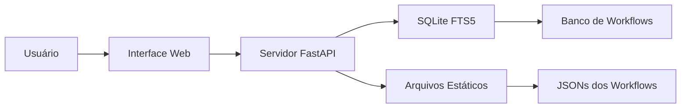

# Coleção de Workflows n8n

<div align="center">


[](https://www.buymeacoffee.com/zie619)

### A Coleção Definitiva de Workflows de Automação do n8n

**[Ver Online](https://zie619.github.io/n8n-workflows)** · **[Documentação](#documentação)** · **[Como Contribuir](#como-contribuir)** · **[Licença](#licença)**

</div>

## Novidades

### Últimas Atualizações (novembro de 2025)
- **Segurança Reforçada**: Auditoria de segurança completa concluída, todas as CVEs resolvidas
- **Suporte a Docker**: Builds multiplataforma para linux/amd64 e linux/arm64
- **GitHub Pages**: Interface de busca ao vivo em [zie619.github.io/n8n-workflows](https://zie619.github.io/n8n-workflows)
- **Desempenho**: Busca 100x mais rápida com integração SQLite FTS5
- **Interface Moderna**: Interface totalmente redesenhada com modo claro/escuro

---

## Acesso Rápido

### Use Online (Sem Instalação)
Acesse **[zie619.github.io/n8n-workflows](https://zie619.github.io/n8n-workflows)** para uso instantâneo de:
- **Busca Inteligente** — Encontre workflows instantaneamente
- **Mais de 15 Categorias** — Navegue por caso de uso
- **Pronto para Mobile** — Funciona em qualquer dispositivo
- **Downloads Diretos** — Baixe os JSONs dos workflows instantaneamente

---

## Recursos

<table>
<tr>
<td width="50%">

### Em Números
- **4.343** Workflows Prontos para Produção
- **365** Integrações Únicas
- **29.445** Nós no Total
- **15** Categorias Organizadas
- **100%** de Taxa de Sucesso na Importação

</td>
<td width="50%">

### Desempenho
- **< 100ms** de Resposta na Busca
- **< 50MB** de Uso de Memória
- **700x** Menor Que a v1
- **10x** Mais Rápido no Carregamento
- **40x** Menos Uso de RAM

</td>
</tr>
</table>

---

## Instalação do n8n (Community Edition) e Importação dos Workflows

Estes workflows são feitos para rodar no **n8n**, a plataforma de automação open source. A seguir estão as instruções da versão **community (self-hosted)** atual, além de como importar os arquivos JSON deste repositório.

### Pré-requisitos
- Docker (recomendado) **ou** Node.js 18+ (para instalação via npm)
- Cerca de 500MB de espaço livre em disco

### Opção 1 — Docker (recomendado)
```bash
# Crie um volume para persistir seus dados
docker volume create n8n_data

# Inicie o n8n community
docker run -it --rm \
  --name n8n \
  -p 5678:5678 \
  -e GENERIC_TIMEZONE="America/Sao_Paulo" \
  -e TZ="America/Sao_Paulo" \
  -e N8N_ENFORCE_SETTINGS_FILE_PERMISSIONS=true \
  -e N8N_RUNNERS_ENABLED=true \
  -v n8n_data:/home/node/.n8n \
  docker.n8n.io/n8nio/n8n

# Abra o editor no navegador
# http://localhost:5678
```

### Opção 2 — npm / npx
```bash
# Executar sem instalar (ideal para testar)
npx n8n

# Ou instalar globalmente
npm install n8n -g
n8n

# Abra o editor no navegador
# http://localhost:5678
```

Na primeira execução, o n8n pede para você criar a conta de proprietário (owner) local. Depois disso, o editor fica disponível em `http://localhost:5678`.

### Importar um workflow deste repositório

**Pela interface (Import from File):**
1. Abra o n8n em `http://localhost:5678`.
2. Na barra superior do editor, clique no menu de **três pontos** (canto superior direito).
3. Selecione **Import from File...** e escolha o arquivo `.json` do workflow (da pasta `workflows/`).
4. O workflow é carregado no editor. Clique em **Save** para mantê-lo na sua instância.

**Pela interface (Import from URL):**
1. No mesmo menu de três pontos, selecione **Import from URL...**.
2. Cole a URL do JSON bruto (raw) do workflow no GitHub.
3. O n8n baixa e carrega o workflow automaticamente. Clique em **Save**.

**Pela linha de comando (CLI):**
```bash
# Importar um único workflow
n8n import:workflow --input=arquivo-do-workflow.json

# Importar todos os workflows de uma pasta
n8n import:workflow --separate --input=./workflows
```

> **Importante:** após importar, configure as **credenciais** (chaves de API, tokens, etc.) em cada nó. Por segurança, as credenciais nunca ficam salvas nos arquivos JSON — elas são armazenadas separadamente na sua instância do n8n.

### Opcional — Interface de busca local
O repositório também inclui uma interface de busca (FastAPI) para explorar a coleção localmente:
```bash
# Clone o repositório
git clone https://github.com/Zie619/n8n-workflows.git
cd n8n-workflows

# Instale as dependências (Python 3.9+)
pip install -r requirements.txt

# Inicie o servidor
python run.py

# Abra no navegador: http://localhost:8000
```

---

## Documentação

### Endpoints da API

| Endpoint | Método | Descrição |
|----------|--------|-------------|
| `/` | GET | Interface web |
| `/api/search` | GET | Buscar workflows |
| `/api/stats` | GET | Estatísticas do repositório |
| `/api/workflow/{id}` | GET | Obter o JSON de um workflow |
| `/api/categories` | GET | Listar todas as categorias |
| `/api/export` | GET | Exportar workflows |

### Recursos de Busca
- **Busca em texto completo** por nomes, descrições e nós
- **Filtro por categoria** (Marketing, Vendas, DevOps, etc.)
- **Filtro por complexidade** (Baixa, Média, Alta)
- **Filtro por tipo de gatilho** (Webhook, Agendamento, Manual, etc.)
- **Filtro por serviço** (mais de 365 integrações)

---

## Arquitetura



### Stack Tecnológica
- **Backend**: Python, FastAPI, SQLite com FTS5
- **Frontend**: JavaScript puro, Tailwind CSS
- **Banco de Dados**: SQLite com Busca em Texto Completo (Full-Text Search)
- **Deploy**: Docker, GitHub Actions, GitHub Pages
- **Segurança**: Varredura com Trivy, proteção CORS, validação de entrada

---

## Estrutura do Repositório

```
n8n-workflows/
├── workflows/           # 4.343 arquivos JSON de workflows
│   └── [categoria]/     # Organizados por integração
├── docs/               # Site do GitHub Pages
├── src/                # Código-fonte Python
├── scripts/            # Scripts utilitários
├── api_server.py       # Aplicação FastAPI
├── run.py              # Inicializador do servidor
├── workflow_db.py      # Gerenciador do banco de dados
└── requirements.txt    # Dependências Python
```

---

## Como Contribuir

Adoramos contribuições! Veja como você pode ajudar:

### Formas de Contribuir
- **Reporte bugs** pelas [Issues](https://github.com/Zie619/n8n-workflows/issues)
- **Sugira recursos** nas [Discussions](https://github.com/Zie619/n8n-workflows/discussions)
- **Melhore a documentação**
- **Envie correções de workflows**
- **Dê uma estrela no repositório**

### Ambiente de Desenvolvimento
```bash
# Faça o fork e clone
git clone https://github.com/SEU_USUARIO/n8n-workflows.git

# Crie uma branch
git checkout -b feature/recurso-incrivel

# Faça as alterações e teste
python run.py --debug

# Faça o commit e o push
git add .
git commit -m "feat: adiciona recurso incrível"
git push origin feature/recurso-incrivel

# Abra um PR
```

---

## Segurança

### Recursos de Segurança
- Proteção contra path traversal
- Validação e sanitização de entrada
- Proteção CORS
- Limitação de taxa (rate limiting)
- Reforço de segurança no Docker
- Usuário não-root no contêiner
- Varreduras de segurança regulares

### Reportando Problemas de Segurança
Por favor, reporte vulnerabilidades de segurança aos mantenedores via [Security Advisory](https://github.com/Zie619/n8n-workflows/security/advisories/new).

---

## Licença

Este projeto é licenciado sob a Licença MIT — consulte o arquivo [LICENSE](LICENSE) para detalhes.

---

## Apoie o Projeto

Se este projeto foi útil para você, considere:

<div align="center">

[](https://www.buymeacoffee.com/zie619)
[](https://github.com/Zie619/n8n-workflows)

</div>

---

<div align="center">


</div>

---

<div align="center">

**Dê uma estrela no GitHub — isso nos motiva muito!**

Feito com cuidado por [Zie619](https://github.com/Zie619) e [colaboradores](https://github.com/Zie619/n8n-workflows/graphs/contributors)

<br />

<a href="https://github.com/Trusera/ai-bom">
  
</a>

**[AI-BOM](https://github.com/Trusera/ai-bom)** — Descubra todos os agentes de IA, modelos e APIs escondidos na sua infraestrutura.
<br />
Open source pela **[Trusera](https://trusera.dev)** — Protegendo a Agentic Service Mesh.

</div>
